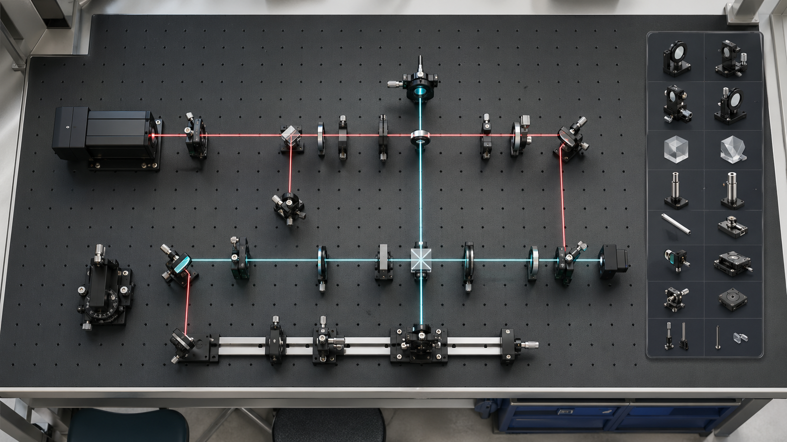
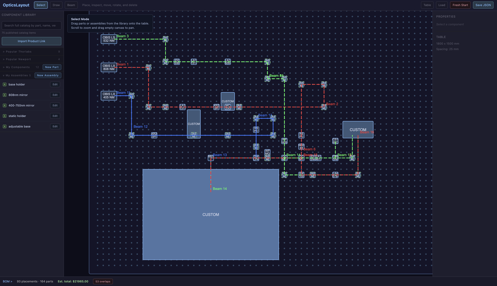

# Optical Table Layout

Use it online at [labtools.studio/optics-layout](https://labtools.studio/optics-layout/).

## How To Use

1. Open the online app or run it locally with `npm run dev`.
2. Use **Table** to set the table size, hole spacing, margins, and units.
3. Search the component library by part number, name, vendor, or category.
4. Drag components from the library onto the 2D optical table canvas.
5. Use **Draw** to create a custom footprint when a part is not in the catalog.
6. Use **Beam** to draw beam paths; select a beam to edit label, wavelength, color, line style, polarization, and power metadata.
7. Select placed components to inspect, rotate, move, delete, or convert stacked parts into an assembly.
8. Open the BOM drawer to review part quantities, estimated totals, and overlap warnings.
9. Export your work as BOM CSV, beam CSV, layout SVG, layout PNG, or layout JSON.
10. Use **Save JSON** and **Load** to move layouts between browsers or machines. The browser also autosaves locally.



The hero image in this README is AI-generated for demonstration purposes. The actual app is a 2D optical table layout planner, not a 3D renderer or optical simulation package.

Optical Table Layout is a lightweight browser-based layout design tool for university labs. It helps plan optical table and breadboard layouts, organize parts, sketch beam paths, and export planning artifacts before assembling a setup in the lab.

This is a layout and documentation tool. It does not perform optical propagation, optomechanical tolerance analysis, Gaussian beam modeling, ray tracing, polarization modeling, or other optical simulation.

Created by Yiwen Song - Postdoc at Penn State University.

## Features

- Configurable optical table dimensions, hole spacing, margins, and units.
- Drag-and-drop component placement on a hole-grid table canvas.
- Component library with built-in vendor-style catalog entries and searchable published catalog data.
- Custom components created by drawing footprints directly on the table.
- Product-link assisted import for adding vendor parts to the local component library.
- Beam path drawing with editable labels, wavelength, color, line style, polarization, and power metadata.
- Properties panel for inspecting, moving, rotating, and deleting selected components, assemblies, and beam paths.
- Assembly workflow for grouping repeated component stacks or reusable sub-layouts.
- Bill of materials drawer with quantity rollups, supplier/part metadata, estimated totals, and overlap warnings.
- Exports for BOM CSV, beam CSV, layout SVG, layout PNG, and full layout JSON.
- JSON load/save workflow for moving layouts between browsers or machines.
- Browser autosave using local storage, with a fresh-start action for clearing the current saved layout.

## Preview



The preview image is an actual screenshot of the 2D layout interface.

## Who It Is For

Optical Table Layout is intended for research groups, teaching labs, and student projects that need a practical way to sketch table layouts and keep purchasing/layout notes together. It is useful for early planning, lab communication, and setup documentation.

Use the generated layout and BOM as planning aids only. Catalog prices and estimated totals may be incomplete, stale, region-dependent, or otherwise inaccurate; check current pricing and availability with the actual vendor before purchasing. Verify dimensions, part compatibility, mounting constraints, safety requirements, and optical performance with the original vendor documentation and appropriate optical analysis.

## Development

Requirements:

- Node.js
- npm

Install dependencies:

```bash
npm install
```

Run the development server:

```bash
npm run dev
```

Build the app:

```bash
npm run build
```

Preview a production build:

```bash
npm run preview
```

Run tests:

```bash
npm test
```

Run linting:

```bash
npm run lint
```

## Catalog Data

The repository includes a generated catalog index under `public/catalog/vendorCatalogIndex.json` so the app can search catalog-style component data locally after build. The scripts under `scripts/` refresh the generated data from maintained vendor-source snapshots and catalog crawls.

The Thorlabs catalog sync script requires an Algolia search API key supplied through the environment:

```bash
ALGOLIA_SEARCH_API_KEY=... npm run sync:thorlabs:sitemap
```

Useful scripts:

```bash
npm run sync:catalog:weekly
npm run sync:vendors:snapshot
```

Vendor names and part numbers are used only as catalog metadata for layout planning.

## Maintenance Model

The LabTools Studio website repository is the maintained source of truth for the deployed app. This public repository is intended as a shareable copy/export of the optical table layout tool.

When refreshing this public copy from the website source, keep the public repository files standalone: the Vite build should output to `dist/`, and generated README images should stay under `public/images/`.

## License

MIT License. See [LICENSE](LICENSE).
